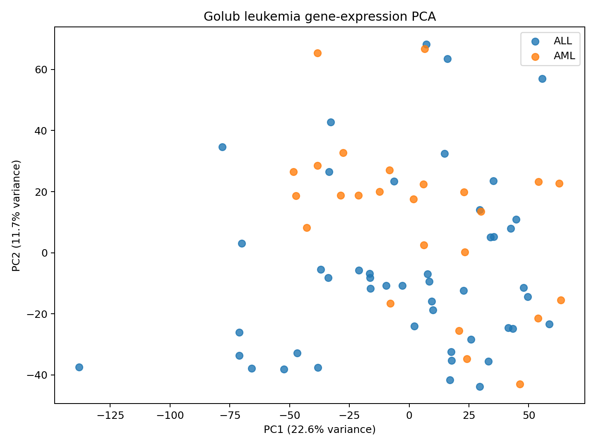
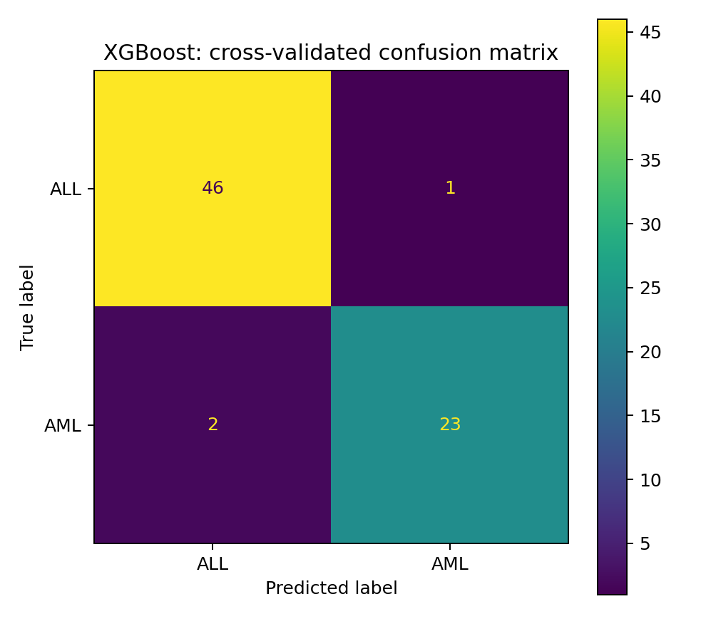
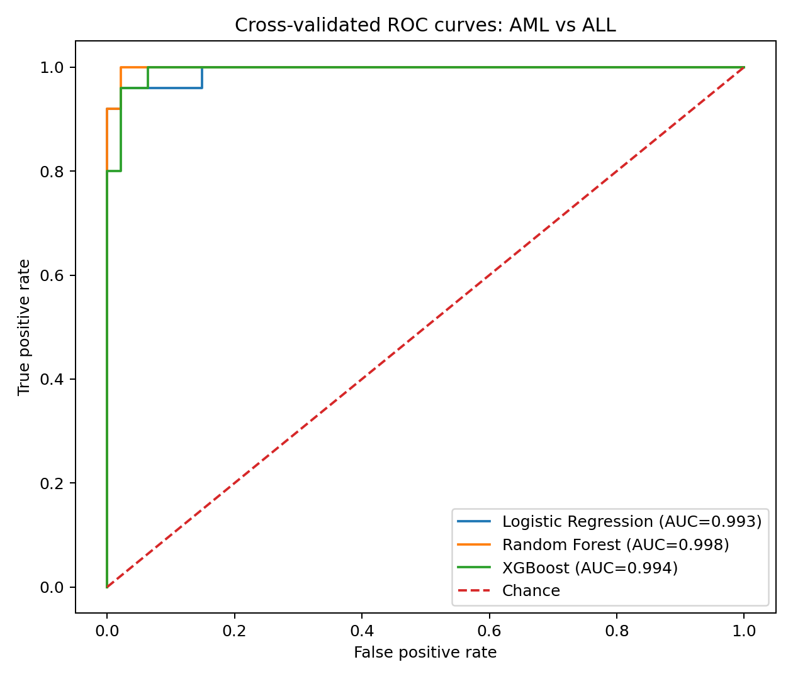
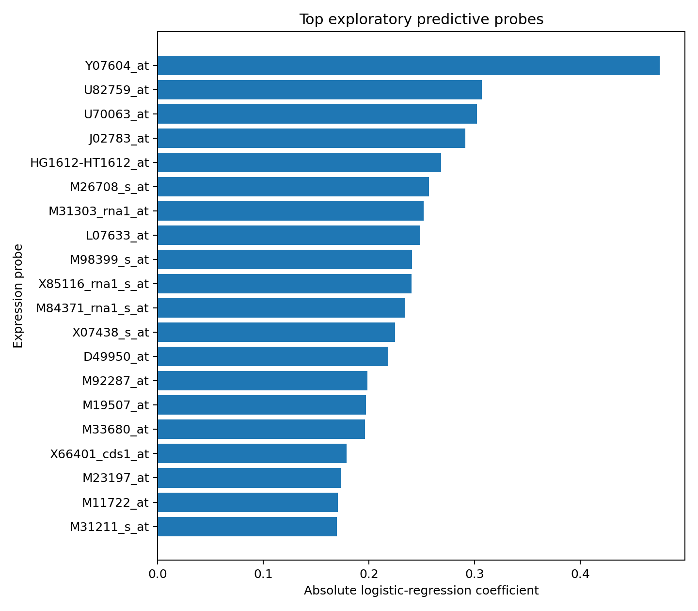

# Gene Expression Classification — Golub Leukemia Dataset

An analysis of 72 leukemia samples with 7,129 expression features, comparing three classifiers while selecting features within each cross-validation fold.

**Python · Gene Expression · Microarray · PCA · Feature Selection · Logistic Regression · Random Forest · XGBoost · Cross-Validation**

---

## Overview

This project analyzes the landmark **Golub leukemia gene-expression dataset** to test whether microarray expression profiles can distinguish:

- **ALL** — Acute Lymphoblastic Leukemia
- **AML** — Acute Myeloid Leukemia

The dataset contains only **72 patient samples** but **7,129 expression features**, making it a classic high-dimensional, low-sample-size (`p >> n`) machine-learning problem.

The project asks two main questions:

1. Can classical machine-learning models distinguish ALL from AML from gene-expression profiles?
2. Which expression probes contribute most strongly to the classification signal?

---

## Dataset

| Property | Value |
|---|---:|
| Total samples | **72** |
| ALL samples | **47** |
| AML samples | **25** |
| Expression features | **7,129** |
| Features selected within each CV fold | **100** |
| Task | Binary classification: ALL vs AML |

The normalized dataset is cached in `data/raw/golub.csv`, which is included in this checkout. The script downloads it only when the cached file is missing; see [raw-data provenance](data/raw/README.md).

Original study:

> Golub TR, Slonim DK, Tamayo P, et al. *Molecular Classification of Cancer: Class Discovery and Class Prediction by Gene Expression Monitoring.* Science. 1999.

---

## Analysis workflow

1. Validate the cached expression matrix and collapse B-cell/T-cell labels into ALL.
2. Inspect global variation with exploratory PCA.
3. Fit zero-variance filtering, selection of 100 features, and each classifier inside stratified five-fold cross-validation.
4. Save fold metrics and pooled out-of-fold predictions, confusion matrices, and ROC curves.
5. Fit a separate full-data model for exploratory probe ranking.

**Read the evidence:** [model comparison](results/tables/model_comparison.csv), [out-of-fold predictions](results/tables/cross_validated_predictions.csv), and [probe ranking](results/tables/top_predictive_probes.csv). The [analysis script](scripts/run_analysis.py) defines preprocessing and evaluation.

## Why Leakage-Safe Feature Selection Matters

This dataset contains **7,129 expression measurements but only 72 patients**.

If feature selection were performed once on the entire dataset before cross-validation, information from validation patients could influence which probes are selected. That would create **data leakage** and could make performance appear better than it really is.

To reduce this risk, feature selection is placed **inside the scikit-learn pipeline**. Each training fold independently chooses its 100 features before being evaluated on the corresponding held-out fold.

---

## Results

### 1. Principal Component Analysis

The first two principal components explained:

| Component | Variance Explained |
|---|---:|
| PC1 | **22.6%** |
| PC2 | **11.7%** |
| PC1 + PC2 | **34.2%** |



### Interpretation

The first two principal components do **not** produce a clean visual separation between ALL and AML.

This is an important result rather than a failure.

PCA is unsupervised: it finds directions that explain the greatest overall variation in the expression matrix without using the leukemia labels. The strongest sources of total variation therefore do not have to be the same directions that best discriminate ALL from AML.

The later supervised models can still perform strongly because they select expression features specifically useful for classification.

---

### 2. Cross-Validated Model Comparison

Three classifiers were evaluated using the same **stratified 5-fold cross-validation** protocol. Table entries are the mean ± sample standard deviation across the five folds (`ddof=1`), not confidence intervals. Fold outcomes are not independent replications.

| Model | Accuracy | Balanced Accuracy | F1 | ROC-AUC |
|---|---:|---:|---:|---:|
| **Logistic Regression** | **0.971 ± 0.064** | **0.969 ± 0.070** | **0.960 ± 0.089** | 0.991 ± 0.020 |
| Random Forest | 0.958 ± 0.038 | 0.950 ± 0.050 | 0.937 ± 0.058 | **1.000 ± 0.000** |
| XGBoost | 0.959 ± 0.037 | 0.950 ± 0.050 | 0.937 ± 0.058 | **1.000 ± 0.000** |

### Main result

**Logistic Regression achieved the highest mean classification accuracy and F1 score**, despite being much simpler than the tree-based ensemble models.

This is a useful result in a `p >> n` biomedical setting: a more complex model did not automatically produce better classification performance.

---

### 3. Cross-Validated Confusion Matrices

### Logistic Regression


Across the pooled out-of-fold predictions:

| True class | Correct | Misclassified |
|---|---:|---:|
| ALL | **46 / 47** | 1 predicted AML |
| AML | **24 / 25** | 1 predicted ALL |

Overall, Logistic Regression correctly classified **70 of 72 patients** in the pooled out-of-fold predictions.

---

### Random Forest


| True class | Correct | Misclassified |
|---|---:|---:|
| ALL | **46 / 47** | 1 predicted AML |
| AML | **23 / 25** | 2 predicted ALL |

Random Forest correctly classified **69 of 72 patients**.

---

### XGBoost



| True class | Correct | Misclassified |
|---|---:|---:|
| ALL | **46 / 47** | 1 predicted AML |
| AML | **23 / 25** | 2 predicted ALL |

XGBoost also correctly classified **69 of 72 patients**.

---

### 4. ROC Analysis



The pooled out-of-fold ROC curves show very strong discrimination:

| Model | Pooled Out-of-Fold ROC-AUC |
|---|---:|
| Logistic Regression | **0.993** |
| Random Forest | **0.998** |
| XGBoost | **0.994** |

The ROC-AUC values in this figure differ slightly from the mean ROC-AUC values in the cross-validation table.

That is expected because the table reports the **mean AUC calculated separately within each fold**, whereas this figure calculates one AUC after pooling all out-of-fold predictions.

---

### 5. Exploratory Predictive Probe Ranking

After cross-validation, a Logistic Regression pipeline was fit to the complete dataset for **exploratory feature interpretation only**.

This final fit is **not an independent validation experiment** and the resulting probe ranking should not be interpreted as a validated biomarker signature.



### Top-ranked probes

| Rank | Probe | Logistic coefficient for AML | Absolute coefficient |
|---:|---|---:|---:|
| 1 | **Y07604_at** | +0.475 | **0.475** |
| 2 | **U82759_at** | +0.307 | **0.307** |
| 3 | **U70063_at** | +0.302 | **0.302** |
| 4 | **J02783_at** | +0.291 | **0.291** |
| 5 | **HG1612-HT1612_at** | -0.268 | **0.268** |
| 6 | **M26708_s_at** | -0.257 | **0.257** |
| 7 | **M31303_rna1_at** | -0.252 | **0.252** |
| 8 | **L07633_at** | -0.249 | **0.249** |
| 9 | **M98399_s_at** | +0.241 | **0.241** |
| 10 | **X85116_rna1_s_at** | +0.240 | **0.240** |

A positive coefficient means higher expression pushes the fitted model toward **AML**, while a negative coefficient pushes it toward **ALL**, after accounting for the other selected features in the model.

---

## Probe annotation context

The saved ranking uses historical Affymetrix probe identifiers. The current analysis script does not query an annotation service or validate gene-symbol mappings. Treat coefficients as probe-level exploratory model results.

A biological interpretation should record the annotation release, map each probe carefully, and cite the supporting literature. The ranking is not an independently validated biomarker signature.

---

## What the comparison establishes

Logistic Regression has the highest mean accuracy and F1 in the saved five-fold run, with 70 of 72 pooled out-of-fold predictions correct. Its advantage over the ensemble models is only one patient in this cohort; this run does not establish a statistically reliable or externally generalizable model ranking.

The PCA and supervised results answer different questions. PCA describes large sources of overall variation; the classifier uses labeled training folds to select discriminative features. Strong classification need not produce clean separation in the first two PCA dimensions.

F1 and ROC-AUC use AML as the positive class. The distinction between fold-mean and pooled AUC matters when checking the tables against the plots.

## Limitations

This analysis has several important limitations:

- The dataset contains only **72 patients**.
- There are **7,129 expression features**, creating a strong risk of overfitting.
- The data come from an older microarray platform rather than modern RNA-seq.
- The cohort is a historical benchmark and is not representative of the diversity or scale expected in modern clinical validation.
- Cross-validation estimates generalization within this dataset but does not replace validation in an independent cohort.
- Hyperparameters were not subjected to a fully nested model-selection procedure.
- Probe rankings from the final full-data fit are exploratory.
- Probe-level coefficients should not be interpreted as causal biological effects.
- Some older Affymetrix probe identifiers require historical annotation resources to map reliably to modern gene symbols.
- High classification performance does not imply clinical readiness.

---

## Reproducing the analysis

Start in the repository root and use a separate environment:

```bash
python -m venv .venv
source .venv/bin/activate
python -m pip install -r requirements.txt
python scripts/run_analysis.py
```

On Windows use `.venv\Scripts\Activate.ps1`. Existing output files can be overwritten; preserve committed results separately before comparing a rerun. Requirements are not a complete environment lock. Record package versions and input checksums alongside generated tables. Committed figures and tables document a previous run; this documentation update did not rerun the analysis.

Classification metrics describe five-fold stratified cross-validation on this dataset, not independent external validation. Feature selection is inside each model pipeline. PCA and full-data probe rankings are exploratory and should not be interpreted as externally validated biomarkers.


---

## Repository Structure

```text
gene-expression-classification/
├── data/
│   ├── raw/
│   │   └── README.md
│   └── processed/
│       └── README.md
├── notebooks/
│   └── gene_expression_classification.ipynb
├── scripts/
│   └── run_analysis.py
├── results/
│   ├── figures/
│   │   ├── pca_all_vs_aml.png
│   │   ├── roc_curves.png
│   │   ├── confusion_logistic_regression.png
│   │   ├── confusion_random_forest.png
│   │   ├── confusion_xgboost.png
│   │   └── top_predictive_probes.png
│   └── tables/
│       ├── dataset_summary.csv
│       ├── model_comparison.csv
│       ├── cross_validated_predictions.csv
│       ├── pca_coordinates.csv
│       └── top_predictive_probes.csv
├── .gitignore
├── requirements.txt
└── README.md
```

---

## Tools and Methods

| Area | Tools / Methods |
|---|---|
| Programming | Python |
| Data manipulation | pandas, NumPy |
| Machine learning | scikit-learn, XGBoost |
| Dimensionality reduction | PCA |
| Feature selection | ANOVA F-statistic (`SelectKBest`) |
| Validation | Stratified 5-fold cross-validation |
| Metrics | Accuracy, balanced accuracy, F1, ROC-AUC |
| Visualization | Matplotlib |
| Data source | Golub leukemia microarray dataset |

---

## References

Golub TR, Slonim DK, Tamayo P, et al. **Molecular Classification of Cancer: Class Discovery and Class Prediction by Gene Expression Monitoring.** *Science*. 1999.

---

## Author

**Siham Boumalak**  
M.S. Artificial Intelligence  
Northeastern University

Research interests include **biomedical informatics, computational biology, transcriptomics, machine learning, trustworthy AI, and reproducible computational research**.

